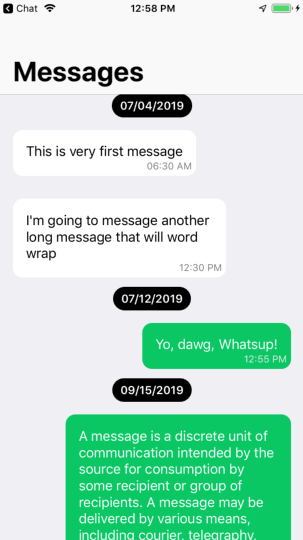

# ChatUI
adjust dynamic height of message bubble based on message text, grouping of messages based on date and sort message under date based on time also.
# How to use

```ruby
# // Create instance of chat list model
var objcChatListModel : ChatListModel = ChatListModel()
# // Create instance of chat messages model array
var MessagesFromServer = [ChatModel]()

# // reload list model, simply passing array of chat model
objcChatListModel.reloadTableWithShorting(arrMessage: MessagesFromServer)
```

# Screenshot


